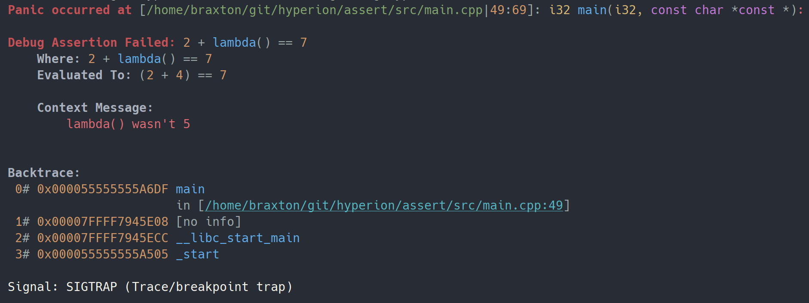

hyperion::assert
****************

hyperion::assert is a C++20 library for all manner of runtime assertions.
It includes assertions for verifying contract requirements (i.e. pre-conditions, post-conditions),
assertions for verifying error conditions have not occurred, debug assertions,
optimization suggestions, and more, all with stacktrace support, user-configurable handling,
optional syntax highlighting, and expression decomposition.

.. code-block:: cpp
    :caption: Example
    :linenos:

    #include <hyperion/assert.h>

    auto example() {
        const auto lambda =  {
            return 4;
        };
        HYPERION_ASSERT_DEBUG(2 + lambda() == 7, "lambda() wasn't {}", 5);
    }

See the :doc:`Quick Start Guide <quick_start>` for how to get started using hyperion::assert.

For an overview of each module, see the links in the left sidebar or below.

.. toctree::
    :caption: Getting Started

    quick_start

.. toctree::
    :caption: Quick Reference

    genindex

.. toctree::
    :caption: Assertions

    assert

.. toctree::
    :caption: Source Location

    source_location
